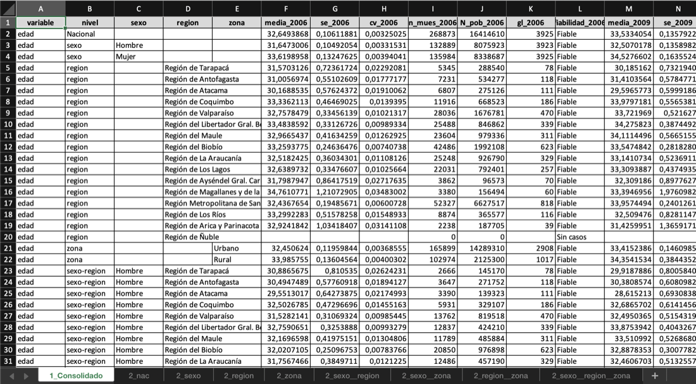
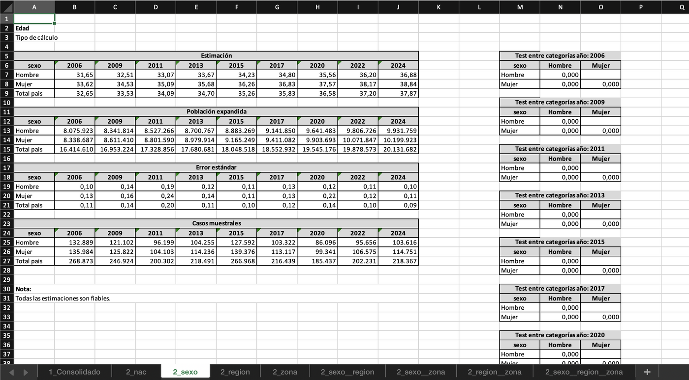

# dosr 

[](https://github.com/GabrielSotomayorl/dosr/actions/workflows/R-CMD-check.yaml)
[](https://lifecycle.r-lib.org/articles/stages.html#stable)
[](https://opensource.org/licenses/MIT)

Herramientas de análisis de encuestas para el Observatorio Social del Ministerio de Desarrollo Social de Chile.

`dosr` provee funciones de alto nivel para calcular estimaciones (medias, proporciones, totales, razones y cuantiles) sobre diseños de encuestas complejas (como la CASEN) y generar reportes estandarizados en Excel con clasificación automática de fiabilidad estadística.

## Instalación

```r
# install.packages("remotes")
remotes::install_github("GabrielSotomayorl/dosr")
```

## Uso básico

```r
library(dosr)
library(srvyr)

design_2022 <- as_survey_design(casen_2022, ids = varunit,
                                strata = varstrat, weights = expr, nest = TRUE)
design_2024 <- as_survey_design(casen_2024, ids = varunit,
                                strata = varstrat, weights = expr, nest = TRUE)

# Proporción de pobreza por región (un año)
obs_prop(design_2022, sufijo = "2022", var = "pobreza",
         des = "region", porcentaje = TRUE, save_xlsx = FALSE)

# Ingreso medio comparando dos años, con pruebas de significancia
obs_media(
  designs = list(design_2022, design_2024),
  sufijo  = c("2022", "2024"),
  var     = "ytotcorh",
  des     = "region",
  sig     = TRUE,
  save_xlsx = FALSE
)
```

## Reportes Excel

Cada función genera automáticamente un `.xlsx` con dos tipos de hojas:

**Hoja consolidada**: tabla completa con todas las estimaciones y métricas de calidad para todas las desagregaciones solicitadas:



**Hojas de formato**: presentación lista para publicar, con bloques separados por métrica (estimación, error estándar, población expandida, casos muestrales) y, cuando `sig = TRUE`, tablas de p-valores para comparaciones intra-año, contra el último año y contra el total nacional:



## Parámetros principales

Todas las funciones `obs_*` comparten los siguientes parámetros:

| Parámetro | Descripción | Default |
|-----------|-------------|---------|
| `designs` | Objeto `tbl_svy` o lista de ellos (varios años) | (requerido) |
| `sufijo` | Etiquetas para cada diseño (p.ej. `c("2022", "2024")`) | autodetectado |
| `var` | Nombre de la variable de interés | (requerido) |
| `des` | Variable(s) de desagregación | `NULL` (solo nacional) |
| `filt` | Filtro como expresión R en string | `NULL` |
| `sig` | Calcular pruebas de significancia estadística | `FALSE` |
| `parallel` | Cálculo en paralelo (distribuye combos o diseños entre workers) | `FALSE` |
| `save_xlsx` | Guardar reporte Excel | `TRUE` |
| `dir` | Directorio de salida | `"output"` |
| `cv_umbral_alto` | Umbral de CV para "No Fiable (CV)" | `0.30` |
| `cv_umbral_medio` | Umbral de CV para "Poco Fiable (CV)" | `0.20` |
| `n_minimo` | Tamaño muestral mínimo | `30` |
| `nivel_confianza` | Nivel de confianza | `0.95` |

## Clasificación de fiabilidad

Los resultados incluyen una columna `fiabilidad` que clasifica automáticamente la calidad de cada estimación:

| Valor | Significado |
|---|---|
| **Fiable** | Estimación publicable sin restricciones |
| **Poco Fiable (CV / EE)** | Publicar con advertencia |
| **No Fiable (CV / gl / muestra)** | No publicar; indica la causa |
| **Sin casos** | Subgrupo sin observaciones en la muestra |

Los criterios se aplican en orden de prioridad (grados de libertad → tamaño muestral → CV o EE). Todos los umbrales son configurables. Consulta la [viñeta de metodología](https://gabrielsotomayorl.github.io/dosr/articles/metodologia.html) para los detalles estadísticos.

## Múltiples diseños (series de tiempo)

```r
resultado_serie <- obs_prop(
  designs    = list(design_2022, design_2024),
  sufijo     = c("2022", "2024"),
  var        = "pobreza",
  des        = "region",
  porcentaje = TRUE,
  sig        = TRUE   # agrega tablas de p-valores al Excel
)
```

## Múltiples variables binarias: `multi_bin()`

```r
# Prevalencia de los 8 indicadores de inseguridad alimentaria FIES
multi_bin(design_2024,
          vars_binarias = paste0("r8", letters[1:8]),
          des           = "area",
          dir           = tempdir())
```

## Requisitos

- R ≥ 3.5.0
- `srvyr`, `dplyr`, `purrr`, `rlang`, `openxlsx`, `haven`, `labelled`
