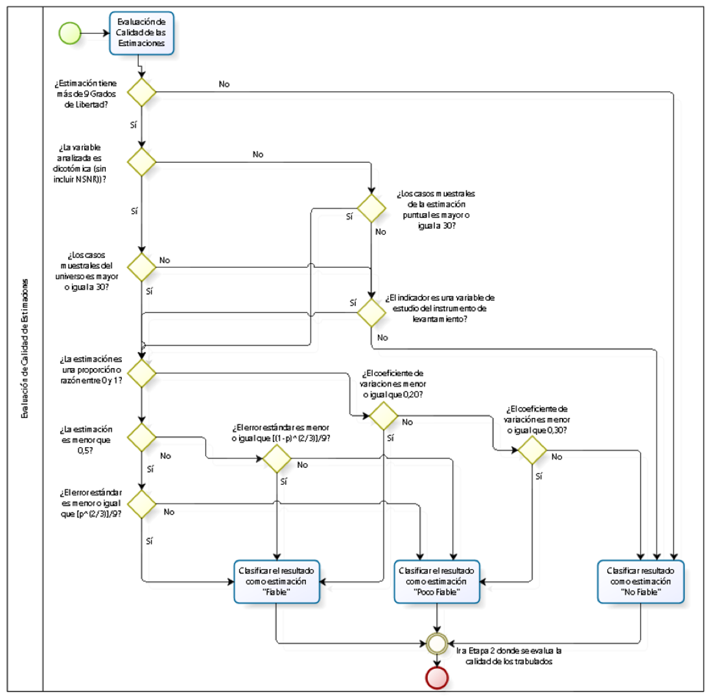

```{r setup, include = FALSE}
knitr::opts_chunk$set(
  collapse = TRUE,
  comment  = "#>"
)
```

Este artículo describe los criterios estadísticos que `dosr` aplica para clasificar la calidad de cada estimación y las pruebas de hipótesis disponibles para comparaciones entre años y entre dominios geográficos.

---

## Diseños de encuesta complejos

`dosr` opera sobre objetos `tbl_svy` del paquete `srvyr`, que encapsulan el diseño muestral complejo de la encuesta (estratos, unidades primarias de muestreo y factores de expansión). Todas las estimaciones se calculan respetando este diseño.

Los **grados de libertad** (gl) de cada dominio se calculan como:

$$\text{gl} = n_{\text{PSU}} - n_{\text{estratos}}$$

donde $n_{\text{PSU}}$ es el número de unidades primarias de muestreo distintas y $n_{\text{estratos}}$ el número de estratos presentes en el dominio. Un valor bajo de gl indica poca información muestral independiente y es el criterio más restrictivo de la clasificación.

---

## Criterios de fiabilidad

El siguiente diagrama muestra el árbol de decisión completo que se aplica a cada estimación:

```{r diagrama, echo = FALSE, out.width = "85%", fig.align = "center", fig.cap = "Árbol de decisión para clasificar la fiabilidad de cada estimación."}

```

### Proporciones (`obs_prop`)

Los criterios se aplican **en orden de prioridad**:

| Prioridad | Categoría | Condición |
|:---------:|---|---|
| 1 | **Sin casos** | $n_{\text{muestral}} = 0$ |
| 2 | **No Fiable (gl)** | $\text{gl} \leq 9$ |
| 3 | **No Fiable (muestra)** | Tamaño insuficiente (ver abajo) |
| 4 | **Poco Fiable (EE)** | Error estándar supera el umbral $\beta$ |
| - | **Fiable** | Ninguno de los anteriores |

**Criterio de tamaño muestral** para proporciones:

- Variable **dicotómica** (2 categorías): se exige $n_{\text{universo}} \geq n_{\text{mínimo}}$, donde $n_{\text{universo}}$ es la suma de casos de todas las categorías del dominio.
- Variable con **más de dos categorías**: se exige $n_{\text{muestral}} \geq n_{\text{mínimo}}$ en la celda.
- `universo_crit = TRUE` fuerza el uso de $n_{\text{universo}}$ en cualquier caso.
- `es_var_estudio = TRUE` relaja este criterio para variables centrales del instrumento.

**Umbral del error estándar** (criterio beta):

$$\text{EE}_{\text{umbral}} = \begin{cases}
\dfrac{\hat{p}^{2/3}}{9} & \text{si } \hat{p} < 0.5 \\[8pt]
\dfrac{(1-\hat{p})^{2/3}}{9} & \text{si } \hat{p} \geq 0.5
\end{cases}$$

Si el EE estimado supera este umbral, la estimación es **Poco Fiable (EE)**.

### Medias, totales, razones y cuantiles

Para estas estimaciones se usa el **coeficiente de variación** (CV = EE / |estimación|):

| Prioridad | Categoría | Condición |
|:---------:|---|---|
| 1 | **Sin casos** | $n_{\text{muestral}} = 0$ |
| 2 | **No Fiable (gl)** | $\text{gl} \leq 9$ |
| 3 | **No Fiable (muestra)** | $n_{\text{muestral}} < n_{\text{mínimo}}$ (salvo `es_var_estudio`) |
| 4 | **No Fiable (CV)** | $\text{CV} > \text{cv\_umbral\_alto}$ (por defecto 0.30) |
| 5 | **Poco Fiable (CV)** | $\text{CV} > \text{cv\_umbral\_medio}$ (por defecto 0.20) |
| - | **Fiable** | Ninguno de los anteriores |

### Parámetros configurables

Todos los umbrales son configurables en cada función `obs_*`:

```{r criterios, eval = FALSE}
obs_media(
  design_2022,
  var             = "ytotcorh",
  cv_umbral_alto  = 0.30,   # umbral para "No Fiable (CV)"
  cv_umbral_medio = 0.20,   # umbral para "Poco Fiable (CV)"
  n_minimo        = 30L,    # tamaño muestral mínimo
  nivel_confianza = 0.95,   # nivel de confianza para intervalos
  save_xlsx       = FALSE
)
```

---

## Pruebas de significancia estadística

Cuando se activa `sig = TRUE` junto con múltiples diseños, `dosr` calcula tres tipos de comparaciones mediante un **test t de Welch** adaptado a diseños complejos:

$$t = \frac{\hat{\theta}_1 - \hat{\theta}_2}{\sqrt{\widehat{\text{EE}}_1^2 + \widehat{\text{EE}}_2^2}}, \qquad \text{gl}_{\text{test}} = \min(\text{gl}_1,\, \text{gl}_2)$$

Los p-valores se obtienen de la distribución $t$ de Student con $\text{gl}_{\text{test}}$ grados de libertad. Este enfoque es conservador: usa el mínimo de grados de libertad de los dos grupos comparados, lo que es apropiado cuando los dominios tienen estructuras de varianza distintas.

### Tipos de comparación

| Tipo | Descripción | Disponible con |
|---|---|---|
| **Intra-anual** | Todas las categorías de una desagregación simple entre sí, para cada año | Un diseño o más |
| **Contra último año** | Cada categoría vs. el año más reciente de la serie | Solo con múltiples diseños |
| **Contra nacional** | Cada categoría vs. el total nacional del mismo año | Con desagregación activa |

Las tablas de p-valores se escriben en hojas adicionales del Excel de formato. Un p-valor < 0.05 indica diferencia estadísticamente significativa al nivel de confianza configurado.

---

## Salida: estructura del reporte Excel

Cuando `save_xlsx = TRUE`, el archivo generado contiene dos tipos de hojas:

- **Hoja `1_Consolidado`**: tabla completa con todas las estimaciones y métricas de calidad (estimación puntual, error estándar, CV, N muestral, N expandido, fiabilidad) para cada combinación de desagregación solicitada.

- **Hojas de formato** (`2_nac`, `2_{variable}`): presentación lista para publicar, con bloques separados por métrica. Cuando `sig = TRUE` y hay múltiples diseños, se agregan tablas de p-valores para las tres comparaciones descritas arriba.

Ver capturas de pantalla de ambos tipos de hoja en la [página principal del sitio](https://gabrielsotomayorl.github.io/dosr/).

---

## Ejemplo con datos reales

```{r ejemplo}
library(dosr)
library(srvyr)

design_2022 <- as_survey_design(casen_2022, ids = varunit,
                                strata = varstrat, weights = expr, nest = TRUE)

# Pobreza extrema por sexo, CASEN 2022
resultado <- obs_prop(
  design_2022,
  sufijo     = "2022",
  var        = "pobreza",
  des        = "sexo",
  porcentaje = TRUE,
  categoria  = "Pobreza extrema",
  save_xlsx  = FALSE,
  verbose    = FALSE
)

cols <- c("sexo", "prop_2022", "se_2022", "n_mues_2022", "fiabilidad_2022")
resultado[resultado$nivel != "Nacional", cols]
```

### Comparación inter-anual con pruebas de significancia

```{r serie, eval = FALSE}
design_2024 <- as_survey_design(casen_2024, ids = varunit,
                                strata = varstrat, weights = expr, nest = TRUE)

# Ingreso medio del hogar por área urbano/rural, 2022 vs. 2024
serie <- obs_media(
  designs = list(design_2022, design_2024),
  sufijo  = c("2022", "2024"),
  var     = "ytotcorh",
  des     = "area",
  sig     = TRUE,
  save_xlsx = FALSE,
  verbose   = FALSE
)

cols_serie <- c("area", "media_2022", "media_2024",
                "fiabilidad_2022", "fiabilidad_2024")
serie[serie$nivel != "Nacional", cols_serie]
```

---

## Referencias

- Lumley, T. (2010). *Complex Surveys: A Guide to Analysis Using R*. Wiley.
- División Observatorio Social, Subsecretaría de Evaluación Social, Ministerio de Desarrollo Social y Familia (2023, actualizado marzo 2024). *Manual para la Investigación. Guía práctica para el uso y análisis de información. Casen 2022*. Santiago: Ministerio de Desarrollo Social y Familia. <https://observatorio.ministeriodesarrollosocial.gob.cl/storage/docs/casen/2022/Manual_para_la_investigacion_Casen_2022(18marzo2024).pdf>
- Valliant, R., Dever, J. A., & Kreuter, F. (2018). *Practical Tools for Designing and Weighting Survey Samples* (2nd ed.). Springer.
